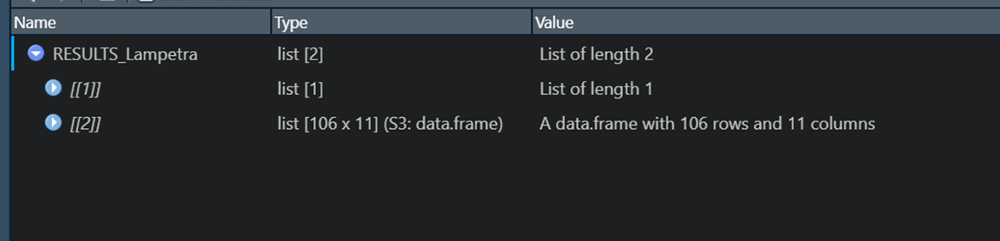
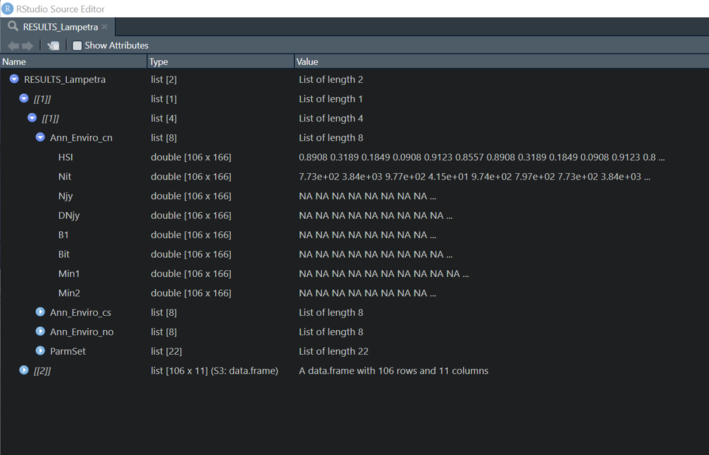
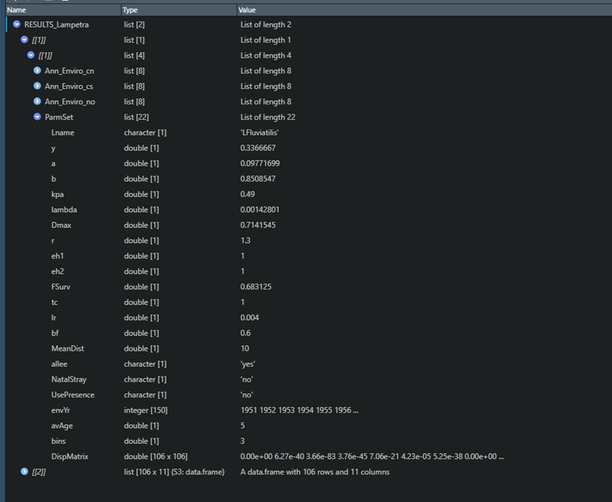
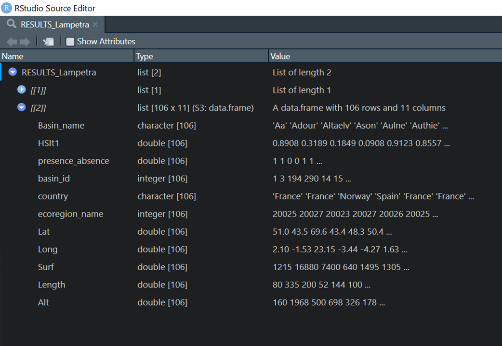

```{r setup, include=FALSE}
knitr::opts_chunk$set(echo = TRUE)
library(tidyverse)
```

## Model Output: List of Lists

The output from a single run of the hybrid model is stored as a list of lists. The first level has two objects:

-   Results[[1]] contains the results from the hybrid model and the set of parameters used for that run
-   Results[[2]] contains the basin information

<br>



<br>

------------------------------------------------------------------------

<br>

### The first output object (Results[[1]])

This level contains the results of the model output as a list that is separated into the three climate models, along with the model paramters. All four of these objects are stored within a separate list so that if we are making comparisons between parameter values, this creates a separate list to contain the output for each set of parameters. These are stored in consecutive list (i.e. Results[[1]][[1]], Results[[1]][[2]], Results[[1]][[3]], etc.)

### Results from each climate model

Each climate model has its own list of output results, designated "Ann_Enviro\_" followed by an abbreviation of the type of climate model (in our example we have Ann_Enviro_cn, Ann_Enviro_cs, and Ann_Enviro_no).

The model is run with an annual time step, but incorporates a form of age structuring that is capable of utilizing multiple age classes for spawners to estimate abundance in a given time step. **See "Simulation of time lag and age structure" below for definition**

Lists of outputs for each climate model have the same structure and essentially follow the successive development of the model equations related to population dynamics and dispersal.



<br><br>

## Definition of data table objects in results from climate model

### Data table objects:

Each of the list objects for one climate model consists of a data table with the same dimensions (rows = basins, columns = time steps), as seen in the following table.

```{r echo = FALSE, eval = TRUE}
TmpTable <- readRDS("Example_table.RDS")
TmpTable
```

<br><br>

**"Initial" Columns**

The first columns in each data table, labelled as "Initial", hold the values to initialize the model. The number of columns is described in the following section about age structure. Values are placed in Initial columns only for HSI and Nit, and the same value for these two variables should be seen for a particular basin in all Initial columns. The other data tables (Njy, DNjy, B1, Bit, Min1, and Min2) should have NAs in the Initial columns because these calculations are not being performed yet. $N_{i(t)}$ for the initial columns is defined as follows:

$$\Large Initial N_{i(t)} = HSI_{i(mean 1901-1991)} * D_{max} * A_i$$ **"Burn" Columns**

This model is currently hard coded to include a burn-in period of 10 years, although this can be easily adjusted as needed. These columns are labelled as "Burn" followed by a number. It currently uses the average HSI estimate from 1901-1911, and so does not change with each time step. In the furture, HSI could be drawn from other ranges of values.

**Projections**

After the burn-in period, columns are created for each year in the vector $envYr$, and are labelled with that year. HSI is projected for each year using information from the calibrated brt and the environmental variables from the climate models.

**Simulation of time lag and age structure**

This model uses the paramater $avAge$, which can be defined for each species as the average age at spawning, to create a temporal lag between the fish produced in a given year and when that cohort contributes to future production. This simulates the time lag between the production of a cohort and when those fish have matured and entered the spawning population. For example, if the $avAge$ is defined as 5, fish produced in year t1 will not be used to estimate spawner abundance until year t6.

The model is also capable of utilizing multiple spawner age classes to estimate abundance in a given time step t, based on the definition of the parameter $bins$. When $bins$ is set to 1, there is no age structuring in the estimation of spawner abundance for the current time step, and only a single year contributes to the current prodution. When $bins$ is \> 1, this simulates a population with multiple cohorts that contribute to production in the current year. This is the conceptual equivalent of fish that reproduce at different ages and/or reproducing in multiple years (iteropairty) all contributing to production in the current year t.

Let $S$ be the set of all ages $s_k$ at which fish contribute to spawining and production. The set $S$ will have a number of terms equal to $bins$ where:

$$\Large S = \displaystyle \{s_k\}_{k = 1}^{bins}$$

Each term $s_k$ in the set of $S$ can be defined such that $avAge$, the mean age at spawning defines the average of all items in the set, and $bins$ defines the spread around that number, such that:

$$\Large s_k = \lfloor avAge + k - (\frac{bins}{2})\rfloor$$

Of the set $S$, $s_1$ is the minimum generation time, and will always be \>= 1. The item $s_{bins}$ will be the maximumn generation time, and will always be $<= 2*avAge$.

The model requires a $s_{bins}$ number of "Initial" columns to ensure that the model can draw from all the necessary cohorts for a full generation.

### Model equations used in each time step

The following equations are used to define the values calculated in the burn-in period and the model projections.

-   **HSI**: Habitat suitability index for each catchment i in time t. For the burn-in period, HSI is kept constant as the average from 1901-1911. For projections, HSI is estimated using boosted regression trees through the function gbm.predict in the package gbm, meaning a different value is estimated for each time t.

-   **Nit**: Fish abundance calculated for each catchment i in time step t, **which is the minimum of Min1 and Min2 (defined below)**; This is the final result of the set of equations, and what is used as the main output of the model. There are two options for estimating $N_{i(t)}$ with and without an Allee effect.

**Without Allee:**

$$\Large N_{i(t)} = min[HSI_{i(t)} * D_{max} * A_i * e^{-h_1}, B_{i(t)} * r]$$ **With Allee:**

$$\Large N_{i(t)} = min[HSI_{i(t)} * D_{max} * A_i * e^{-h_1}, B_{i(t)} * \frac {B_{i(t)}^2}{B_{i(t)}^2 + (\lambda * D_{max} * A_i)^2} * r]$$ <br>

The calculation of $B_{i(t)}$ within the equation for $N_{i(t)}$ is broken up into steps, and the results from each step are stored in a separate data table. These calculations are defined as follows:

-   **Njy**: Calculates the proportion of emigrants in each basin

$$\Large N_{jy} = \sum^{S} \frac{N_{j(t-S)}}{bins} * \gamma  $$ where

$$ \Large S = \displaystyle \{S_k\}_{k = 1}^{bins}$$ and $bins$ is defined by the user.

-   **DNjy**: Applies a matrix that encompasses both dispersal and mortality based on the distance dispersed to emigrant spawners; dispersal and mortality are both species-specific; Uses the results from $N_{jy}$ in the calculation

$$\Large DN_{jy} =  \displaystyle \sum_{j\ne i \in \Omega}[\sum^S \frac{N_{j(t-S)}}{bins} * \gamma * \frac{e^{-\alpha*d_{j-i}^\beta}}{\displaystyle \sum_{l\neq j \in \Omega} e^{-\alpha*d_{j-l}^\beta}} *e^{-m*d_{j-i}}]$$

-   **B1**: Calculates the proportion of spawners that home to their origin catchment

$$\Large B1 = \sum^S \frac{N_{i(t-S)}}{bins} * (1 - \gamma)$$

-   **Bit**: Combines the spawners that home cathment i in time t with the spawners that emigrate into catchment i in time t from all surrounding catchments to get a total number of spawners in catchment i; Combines DNjy and B1

$$\Large B_{i(t)} = ((\sum^S \frac{N_{i(t-S)}}{bins} * (1 - \gamma)) + \displaystyle \sum_{j\ne i \in \Omega}[\sum^S \frac{N_{j(t-S)}}{bins} * \gamma * \frac{e^{-\alpha*d_{j-i}^\beta}}{\displaystyle \sum_{l\neq j \in \Omega} e^{-\alpha*d_{j-l}^\beta}} *e^{-m*d_{j-i}}]) * e^{-h_2} $$

This can also be defined as:

$$\Large B_{i(t)} =  (B1 + DN_{jy}) * e^{-h_2}$$ <br>

Now the two parts of the equation for $N_{i(t)}$ are calculated so that the minimum of the two can be used as the final value in the $N_{i(t)}$ data table.

-   **Min1**: Calculates the first part of the equation for $N_{i(t)}$ that incorporates habitat suitability

$$\Large  Min1 = HSI_{i(t)} * D_{max} * A_i * e^{-h_1}$$

-   **Min2**: Calculates the second part of the equation for $N_{i(t)}$ that incorporates the results from $B_{i(t)}$. There are two options for estimating Min2, with or without an Allee effect (as was shown in the first set of equations).

**Without Allee:**

$$\Large Min2 =  B_{i(t)} * r$$ **With Allee:**

$$ \Large Min2 = \frac {B_{i(t)}^2}{B_{i(t)}^2 + (\lambda * D_{max} * A_i)^2}$$

And finally, as stated above, $N_{i(t)}$ is the minimum of Min1 and Min2: $$ \Large N_{i(t)} = min(Min1, Min2)$$

<br><br>

<br><br>

### Set of parameter values

The fourth object in results[[1]] includes all parameter values that were used for this run of the model, as seen below.



<br><br>

### Definition of parameters:

-   **As a Note**: The dispersal function is set up that multiple model runs can be done simultaneously. A vector of multiple values can be provided to the function for all parameters except for **envYr**, **avAge**, and **bins**. If multiple values are provided for more than one parameter, the model will test all combinations in seperate model runs. Be careful of creating long processing times.

-   **Lname**: Abbreviation of species scientific name

-   **y**: Proportion of emigrants ($\gamma$ value in equations)

-   **a**: scale parameter for the dispersal kernel ($\alpha$ in equations)

-   **b**: shape parameter for the dispersal kernel ($\beta$ in equations)

-   **kpa**: Maximized kappa value from calibration of brt models; This value can be used as the threshold for absence vs presence when converting projected HSI values for each catchment to 0 and 1 for absence/presence maps

-   **lambda**: parameter for the Allee effect ($\lambda$ in equations)

-   **Dmax**: maximum density per $km^2$ ($D_{max}$ in equations)

-   **r**: population growth rate ($r$ in equations)

-   **eh1**: anthropogenic effect that reduces the maximum number of fish in a catchment (i.e. habitat degredation, low passage rates, freshwater fishery); currently set at 1 for all species because of a lack of data

-   **eh2**: anthropogenic effect that is a direct source of mortality (ex: marine fishery, marine pollution); currently set at 1 for all species because of a lack of data

-   **FSurv**: proportion of the cohort expected to survive during time step t; used to calculate the annual instantaneous mortality rate ($m$) in the equations ($m = ln(F_{Surv})$)

-   **tc**: tree complexity for the calibrated brt models; kept at 1 for all species so as to not take variable interactions into consideration

-   **lr**: learning rate for the calibrated brt models

-   **br**: bag fraction for the calibrated brt models

-   **MeanDist**: mean distance (km) that emigrant spawners can travel, according to results of diadromous fish expert survey

-   **allee**: Should an Allee effect should be included in calculation of $N_{i(t)}$? Takes 'yes' or 'no', and must be defined at beginning of model run or will result in a warning

-   **NatalStray**: Should emigrating spawners be allowed to stray back to their catchment of origin? Takes 'yes' or 'no', and this variable must be defined at the beginning of the model run or will result in a warning

-   **UsePresence**: Should the value of $N_{i(t)}$ used to initialize the model include zeros where the raw data indicates this species is absent? Takes 'yes' or 'no', and must be defined at the beginning of the model run or will result in a warning

-   **envYr**: A vector defining the time period used in the model

-   **avAge**: Defines the time step being used when projecting abundances forward through time; based on the average spawning age of the species and defines which column to use as $(t-1)$ when calculating variables

-   **bins**: Allows for drawing spawing abundance from multiple columns to simulate several year classes contributing to spawing population in time t. This will diffuse the impact of any single poor year classes on future time steps.

-   **DispMatrix**: Matrix used in calculation of $DN_{jy}$ and ultimately $B_{i(t)}$; this combines the distance matrix and the mortality matrix, and therefore the values can change if the values of $F_{Surv}$, $\alpha$, and/or $\beta$ change (which is why this matrix needs to be stored individually); Calculation of this matrix is as follows:

$$\Large \frac{e^{-\alpha*d_{j-i}^\beta}}{\displaystyle \sum_{l\neq j \in \Omega} e^{-\alpha*d_{j-l}^\beta}} *e^{-m*d_{j-i}}])$$ <br>

------------------------------------------------------------------------

<br>

### The second output object (results[[2]])

This list object contains information related to the basins used in the analysis. Two of these are related to the species in question (HSIt1 and presence_absence), while the others are the same values regardless of species.



<br><br>

### Definition of objects in this list:

-   **Basin_name**: The name of the basin

-   **HSIt1**: The average HSI value from 1901-1911 for this species for each basin; used to initialize the hybrid SDM

-   **presence_absence**: The recorded presence and absence values for the species for each basin, representing the time period 1851-1950

-   **basin_id**: A unique id given to each basin that is also used in the EuroDiad v4 database

-   **country**: The country in which each basin is located

-   **ecoregion_name**: A code for the ecoregion that each catchment is located within

-   **Lat**: The latitude of the outlet of the basin

-   **Long**: The longitude of the outlet of the basin

-   **Surf**: The surface area of the basin; used to calculate projected HSI

-   **Length**: The length of the main watercourse; used to calculate projected HSI

-   **Alt**: The altitude at the source of the river; used to calculate projected HSI
